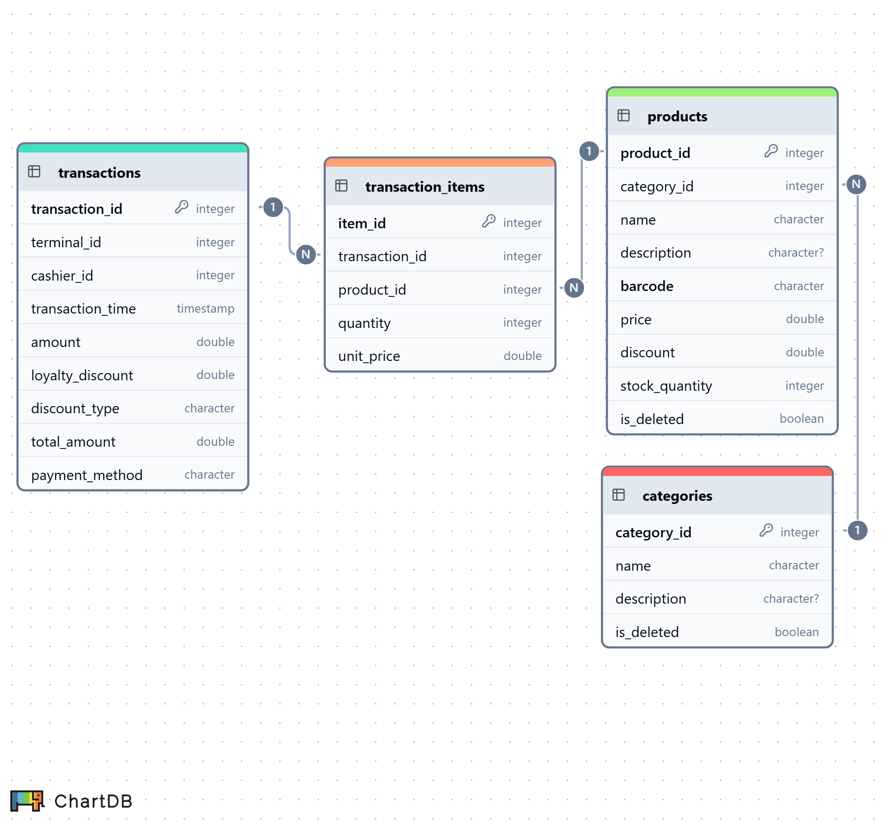

<!-- omit in toc -->
## Languages
[](https://www.python.org/)

<!-- omit in toc -->
## Frameworks
[](https://www.sqlalchemy.org/)
[](https://fastapi.tiangolo.com/)
[](https://aiokafka.readthedocs.io/)
[](https://github.com/SerhiiDolhopolov/rossmann_oltp)

<!-- omit in toc -->
## Services
[](https://www.docker.com/)
[](https://www.postgresql.org/)

<!-- omit in toc -->
## Table of Contents
- [Introduction](#introduction)
- [Project workflow](#project-workflow)
- [Docker Containers](#docker-containers)
- [Database Schema](#database-schema)
- [Kafka consumer](#kafka-consumer)
- [Kafka producer](#kafka-producer)
- [Getting Started](#getting-started)
- [Next Section of the Project](#next-section-of-the-project)

## Introduction
🟢 **This is part 3 of 7 Docker sections in the 🔴 [Supermarket Simulation Project](https://github.com/SerhiiDolhopolov/rossmann_services).**

🔵 [**<- Previous part with a General OLTP DB.**](https://github.com/SerhiiDolhopolov/rossmann_oltp)

## Project workflow
This section contains the simulation of five offline markets, each with 3 terminals. The database is created using the [SQLAlchemy](https://www.sqlalchemy.org/) ORM. Tables with product and category info serve as cache tables for the overall database. The tables are synchronized via Sync API at the start of the work shift and then synchronize stream data via [Kafka](https://kafka.apache.org/).

At the end of each work shift, the shop sends a report about transactions to [ClickHouse](https://clickhouse.com/). Each delivery report is also sent to [ClickHouse](https://clickhouse.com/).

## Docker Containers
**This Docker section includes:**
  - **Five LOCAL OLTP DBs**
    - Server for Adminer:
      - `local_db_1:5432`
    - Server for external tools:
      - `localhost:2000`
    - Other:
      - `admin`
  - **Five Apps**

## Database Schema
The schema was created at [chartdb.io](https://chartdb.io/).

**Products** and **Categories** are cache tables for the General OLTP DB.



## Kafka consumer
The Kafka consumer is implemented using the async version - [aiokafka](https://aiokafka.readthedocs.io/en/stable/). Kafka consumes messages from topics with updated product/category info. Data modification occurs through the upsert strategy. Aiokafka does not include a reconnect mechanism, so it was implemented separately.

## Kafka producer
The Kafka producer is also implemented via [aiokafka](https://aiokafka.readthedocs.io/en/stable/). The Kafka producer sends messages about product quantity at regular intervals.

## Getting Started
**To start:**
1. Complete all steps in the [main part](https://github.com/SerhiiDolhopolov/rossmann_services).
2. Run the services:
```bash
docker compose up --build
```

## Next Section of the Project

[Rossmann Users DB](https://github.com/SerhiiDolhopolov/rossmann_users_db)
